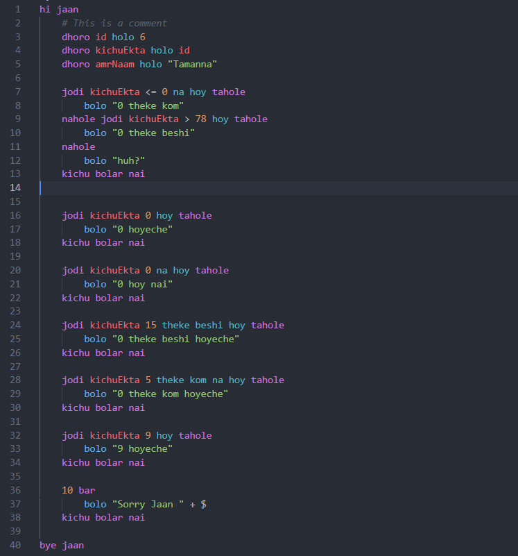

# JaanLang Documentation

JaanLang is a programming language for couples and romantic people. It is a minimal language that anyone can learn very quickly. Enjoy the romantic coding experience!

## Install
Type `npm i -g jaan` in the terminal

## Syntax

### Basic Commands

#### `hi jaan`
Start of the program.

#### `bye jaan`
End of the program.

#### `dhoro`
Declare a variable: `let <variableName>`.

#### `holo`
Assign a value to a variable: `<variableName> = <value>`.

#### `bolo`
Print statement: `console.log(<value>)`.

#### `kichu bolar nai`
End of any block.

### Conditionals

#### `jodi <variableName> <operator> <value> tahole`
If statement.

- `<variableName>`: Name of the variable.
- `<operator>`: Comparison operator (e.g., `hoy`, `na hoy`, `theke beshi`, `theke kom`, etc.).
- `<value>`: Value to compare against.

#### `tahole`
Start of the if block: `{`.

### Loops

#### `bar`
Range loop: `for (let $ = 1; $ <= <value>; $++) {`.

- `$`: Iteration count variable.
- `<value>`: The upper limit for the loop.

### Comments

#### `#`
Comment: Lines starting with `#` are ignored.

## Example

